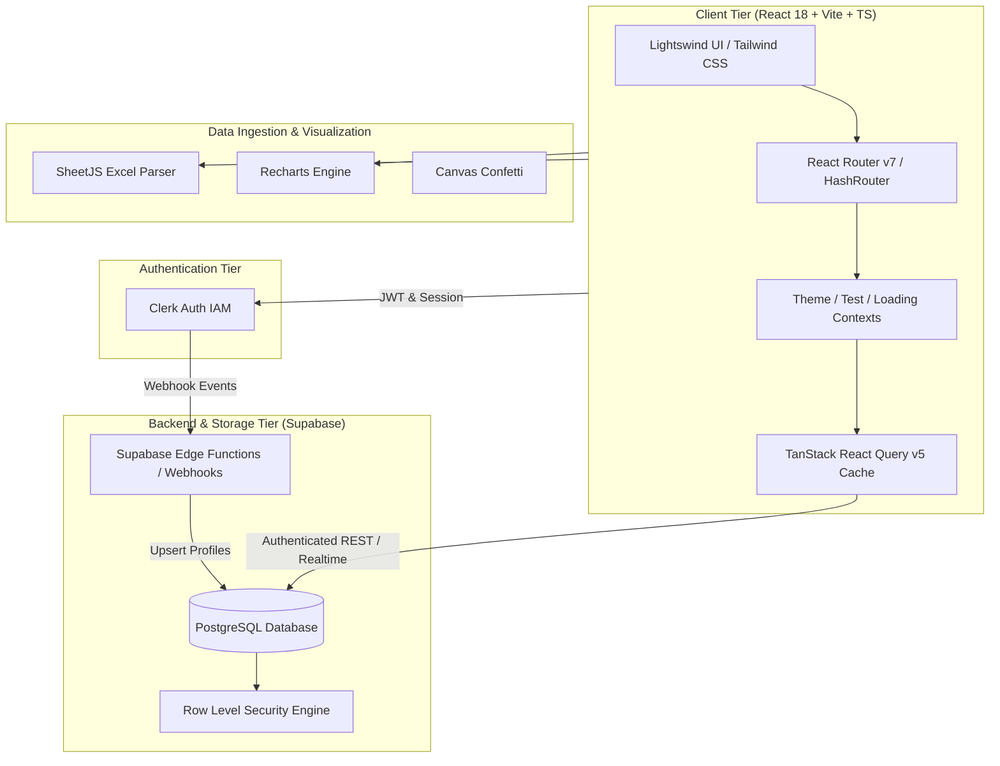

# 🎓 QuizMaster — Advanced MCQ Examination & Assessment Platform

<div align="center">


**An enterprise-grade, full-stack automated MCQ quiz creation, proctoring, and analytics ecosystem.**  
*Developed as a Computer Science & Engineering Capstone Project.*

[](https://reactjs.org/)
[](https://www.typescriptlang.org/)
[](https://vitejs.dev/)
[](https://tailwindcss.com/)
[](https://supabase.com/)
[](https://clerk.com/)
[](https://tanstack.com/query)
[](LICENSE)

[Live Demo](#-deployment--cicd) • [Architecture](#-system-architecture) • [Features](#-key-features) • [Installation](#-getting-started) • [Database Setup](#-database-setup)

</div>

---

## 📖 Executive Summary

**QuizMaster** is a modern, responsive web application engineered to streamline online assessments for academic institutions, educators, and students. It bridges the gap between complex test authoring and seamless student test-taking by providing **automated grading, real-time analytics, Excel bulk question importing, anti-cheat exam integrity monitoring, and strict Role-Based Access Control (RBAC)**.

Powered by **React 18**, **TypeScript**, **Supabase (PostgreSQL with Row Level Security)**, and **Clerk Authentication**, QuizMaster offers sub-second test caching, rich interactive data visualisations via **Recharts**, and an award-winning UI experience using **Tailwind CSS**, **Framer Motion**, and **Lightswind UI**.

---

## ✨ Key Features

### 👨‍🏫 Teacher / Instructor Portal
- **Intuitive Test Builder**:
  - Configure test title, description, time duration, and per-question time limits.
  - Granular negative marking toggle with custom weightings.
  - Schedule test activation windows (start and end date-time) with active/inactive state management.
- **Bulk Question Import via Excel**:
  - Upload hundreds of questions in seconds using the standardized `QuizMaster_MCQ_AutoID_Template.xlsx`.
  - Automatic parsing, validation, and database ingestion using SheetJS (`xlsx`).
- **Question Bank Repository**:
  - Search, filter, tag, edit, and organize reusable questions across multiple subjects and domains.
- **Comprehensive Gradebook & Analytics**:
  - Real-time submission monitoring and student result summaries.
  - Interactive performance metrics (average score, highest score, completion time, question difficulty index).
  - Export test submissions and student performance directly to formatted Excel spreadsheets (`.xlsx`).
- **Student Roster Management**:
  - Monitor registered students, track participation history, and inspect individual test responses.

### 👨‍🎓 Student Examination Portal
- **Distraction-Free Exam Interface**:
  - Clean question palette with real-time status indicators (Answered, Marked for Review, Unvisited).
  - High-precision synchronized countdown timer with automated submission upon expiry.
  - Dynamic time-warning alerts and quick jump navigation.
- **Academic Integrity Guardrails**:
  - Full-screen enforcement alerts and tab-switching monitoring.
- **Instant Detailed Feedback**:
  - Post-test score calculation with point totals, accuracy rates, and time breakdowns.
  - Question-by-question review highlighting chosen options, correct answers, and thorough explanations.
- **Student Performance Dashboard**:
  - Track historical quiz attempts, visual progress trends over time (Recharts line & bar charts), and achievement badges.
  - Confetti celebratory animations on test completion.

### 🛡️ Enterprise Security & Platform Architecture
- **Clerk Identity & Access Management**: Secure single sign-on (SSO), multi-factor authentication, and instant metadata role synchronization (`teacher` vs `student`).
- **PostgreSQL Row Level Security (RLS)**: Enforced database-level security policies preventing unauthorized access to draft tests, correct answer keys, and student grades.
- **Clerk Webhook Integration**: Automated profile synchronization to Supabase via Edge Functions (`supabase/functions/clerk-webhook`).
- **Sub-Second Performance**: Pre-warming caches with **TanStack React Query v5** to eliminate layout shifts and deliver instant test loading.
- **Theme Customization**: Full dark and light mode support with fluid transitions and persistent user preferences.

---

## 🏛️ System Architecture



---

## 📂 Project Structure

```
CSE_FINAL_YEAR_PROJECT-main/
├── .github/
│   └── workflows/
│       ├── deploy.yml               # Automated GitHub Pages CI/CD pipeline
│       └── keep-supabase-alive.yml   # Scheduled cron to maintain database activity
├── public/
│   ├── 404.html                     # SPA redirect handler for GitHub Pages
│   ├── favicon.svg                  # Application brand icon
│   └── QuizMaster_MCQ_AutoID_Template.xlsx # Excel template for bulk question upload
├── src/
│   ├── components/
│   │   ├── layouts/                 # Student & Teacher responsive dashboard layouts
│   │   ├── lightswind/              # Rich interactive UI component library
│   │   ├── shared/                  # Navbar, Modals, Spinners, Error Boundaries, Role Setup
│   │   ├── student/                 # Student-specific components
│   │   ├── teacher/                 # Teacher-specific components (Date Pickers, Test Info)
│   │   ├── test/                    # Test header, sticky footer, time warnings
│   │   └── ui/                      # Toast notifications, CountUp, Squares canvas
│   ├── contexts/
│   │   ├── LoadingContext.tsx       # Global loading state provider
│   │   ├── SidebarContext.tsx       # Responsive dashboard sidebar controller
│   │   ├── TestContext.tsx          # Active exam state, answers, timer provider
│   │   └── ThemeContext.tsx         # Dark/Light theme manager
│   ├── hooks/
│   │   ├── quizMutations.ts         # React Query mutations (create/edit test, submit)
│   │   ├── quizQueries.ts           # React Query queries (fetch tests, results, analytics)
│   │   ├── use-mobile.tsx           # Viewport breakpoint detection
│   │   └── useTest.ts / useTheme.ts # Custom context consumers
│   ├── lib/
│   │   ├── clerkUtils.ts            # Clerk user synchronization utilities
│   │   ├── confetti.ts              # Reward animation trigger
│   │   ├── roleUtils.ts             # Role canonicalization helpers
│   │   ├── supabase.ts              # Supabase client initializer
│   │   └── utils.ts                 # Tailwind class merging (clsx + twMerge)
│   ├── pages/
│   │   ├── auth/                    # Sign-in / Sign-up authentication view
│   │   ├── common/                  # Landing Page, Reviews, User Profile
│   │   ├── student/                 # Dashboard, Take Test, Instructions, Results, Performance
│   │   └── teacher/                 # Dashboard, Test Creation, Edit, Analytics, Students, Question Bank
│   ├── types/                       # TypeScript interfaces & declarations
│   ├── App.tsx                      # Root route configuration & role guards
│   ├── index.css                    # Tailwind design system & custom animations
│   └── main.tsx                     # React entrypoint wrapped with Clerk & Query providers
├── supabase/
│   ├── functions/
│   │   └── clerk-webhook/           # Deno Edge Function for Clerk-Supabase sync
│   └── config.toml                  # Supabase CLI project configuration
├── .env.example                     # Environment variables template
├── .eslintrc.cjs                    # ESLint linting rules
├── .gitignore                       # Git ignore configuration
├── DB_Schema.sql                    # Complete PostgreSQL database schema with RLS
├── index.html                       # HTML template with SPA redirect support
├── package.json                     # NPM dependencies and scripts
├── tailwind.config.js               # Tailwind design tokens & plugins
├── tsconfig.json                    # TypeScript compiler configuration
└── vite.config.ts                   # Vite bundler configuration
```

---

## 🗄️ Database Schema

The complete relational schema with Row Level Security is codified in [`DB_Schema.sql`](file:///c:/Users/viren/Pictures/CSE_FINAL_YEAR_PROJECT-main/CSE_FINAL_YEAR_PROJECT-main/DB_Schema.sql).

### Core Entities

| Table | Description | Key Attributes |
| :--- | :--- | :--- |
| **`profiles`** | Synchronized user accounts with role designations | `id (UUID)`, `name`, `email`, `role (enum: teacher, student)`, `created_at` |
| **`tests`** | Assessments authored by instructors | `id`, `title`, `description`, `duration`, `time_per_question`, `negative_marking_enabled`, `negative_marks`, `start_date`, `end_date`, `is_active`, `created_by` |
| **`questions`** | MCQs belonging to specific tests | `id`, `test_id`, `question_text`, `options (JSONB)`, `correct_answer`, `explanation`, `order_index` |
| **`test_results`** | Student exam submission records | `id`, `test_id`, `student_id`, `score`, `total_questions`, `time_taken`, `answers (JSONB)`, `completed_at` |
| **`reviews`** | Student ratings and testimonials | `id`, `user_id`, `rating`, `comment`, `created_at` |

---

## 🚀 Getting Started

### 1. Prerequisites
Ensure you have the following installed on your machine:
- [Node.js](https://nodejs.org/) (version **18.x** or higher)
- [npm](https://www.npmjs.com/) (version **9.x** or higher) or [pnpm](https://pnpm.io/)
- A free [Supabase](https://supabase.com/) account
- A free [Clerk](https://clerk.com/) account

---

### 2. Clone & Install Dependencies

```bash
# Clone the repository
git clone https://github.com/your-username/QuizMaster.git

# Navigate into the project directory
cd QuizMaster

# Install all npm dependencies
npm install
```

---

### 3. Configure Environment Variables

Create a `.env` file in the root directory by copying the provided [`.env.example`](file:///c:/Users/viren/Pictures/CSE_FINAL_YEAR_PROJECT-main/CSE_FINAL_YEAR_PROJECT-main/.env.example):

```bash
cp .env.example .env
```

Open `.env` and fill in your credentials:

```env
# Supabase Credentials (from Supabase Dashboard -> Settings -> API)
VITE_SUPABASE_URL=https://your-project-id.supabase.co
VITE_SUPABASE_ANON_KEY=your-supabase-anon-key-here

# Clerk Credentials (from Clerk Dashboard -> API Keys)
VITE_CLERK_PUBLISHABLE_KEY=pk_test_your_clerk_publishable_key_here
```

---

### 4. Database Setup

1. Log in to your [Supabase Dashboard](https://supabase.com/dashboard) and create a new project.
2. In the left navigation, open the **SQL Editor**.
3. Copy the contents of [`DB_Schema.sql`](file:///c:/Users/viren/Pictures/CSE_FINAL_YEAR_PROJECT-main/CSE_FINAL_YEAR_PROJECT-main/DB_Schema.sql) and paste it into the query runner.
4. Click **Run** to execute the script. This will create:
   - Custom enum types (`user_role`).
   - Tables (`profiles`, `tests`, `questions`, `test_results`, `reviews`).
   - Indexes and foreign keys.
   - Row Level Security (RLS) policies.

---

### 5. Run the Application

```bash
# Start the local Vite development server
npm run dev
```

Open your browser and navigate to `http://localhost:5173`.

---

## 📊 Bulk Question Upload via Excel

Teachers can rapidly generate exams by importing questions via Excel:

1. Download the template from `public/QuizMaster_MCQ_AutoID_Template.xlsx` (or directly within the Teacher Test Creator page).
2. Populate the columns:
   - `Question`: The question prompt.
   - `Option A`, `Option B`, `Option C`, `Option D`: Multiple-choice choices.
   - `Correct Option`: Single integer (`0` for A, `1` for B, `2` for C, `3` for D) or letter (`A`, `B`, `C`, `D`).
   - `Explanation` *(Optional)*: Explanatory text for post-test review.
3. Drag & drop the `.xlsx` file onto the **Test Creation** or **Question Bank** upload zone.

---

## 🛠️ Available Scripts

| Command | Action |
| :--- | :--- |
| `npm run dev` | Starts the Vite development server with Hot Module Replacement (HMR). |
| `npm run build` | Bundles the application for production into the `dist/` directory with TypeScript validation. |
| `npm run preview` | Locally serves the production bundle for pre-deployment verification. |
| `npm run lint` | Runs ESLint across all TypeScript and React files. |
| `npm run stylelint` | Runs Stylelint on CSS styles to ensure Tailwind and CSS standards. |

---

## 🌐 Deployment & CI/CD

### Deploying to GitHub Pages
The project includes an automated GitHub Actions workflow at [`.github/workflows/deploy.yml`](file:///c:/Users/viren/Pictures/CSE_FINAL_YEAR_PROJECT-main/CSE_FINAL_YEAR_PROJECT-main/.github/workflows/deploy.yml).

1. In your GitHub repository, go to **Settings > Secrets and variables > Actions**.
2. Add the following repository secrets:
   - `VITE_SUPABASE_URL`
   - `VITE_SUPABASE_ANON_KEY`
   - `VITE_CLERK_PUBLISHABLE_KEY`
3. Go to **Settings > Pages** and set the Build and deployment Source to **GitHub Actions**.
4. Push to the `main` branch to trigger the build and deploy pipeline automatically.

### Database Persistence Cron
To prevent free-tier Supabase projects from pausing after periods of inactivity, a scheduled health check workflow is configured in [`.github/workflows/keep-supabase-alive.yml`](file:///c:/Users/viren/Pictures/CSE_FINAL_YEAR_PROJECT-main/CSE_FINAL_YEAR_PROJECT-main/.github/workflows/keep-supabase-alive.yml) to execute every 3 days.

---

## 🔒 Security & Privacy

- **Row Level Security (RLS)**: Enforces access barriers on the PostgreSQL engine level. Students can only read their own test submissions and active tests.
- **Answer Key Protection**: Correct answers and explanations are protected during active test sessions.
- **Client Sanitization**: Environment keys are separated into public publishable tokens and secret backend keys.

---

## 👥 Contributors & Academic Credits

- **Project Type**: Final Year Capstone Project (B.E. / B.Tech Computer Science & Engineering)
- **Primary Focus**: Web Engineering, Cloud Database Systems, Distributed Authentication, Assessment Analytics.

---

## 📄 License

This project is licensed under the [MIT License](LICENSE) — feel free to use and adapt it for academic and commercial projects.
